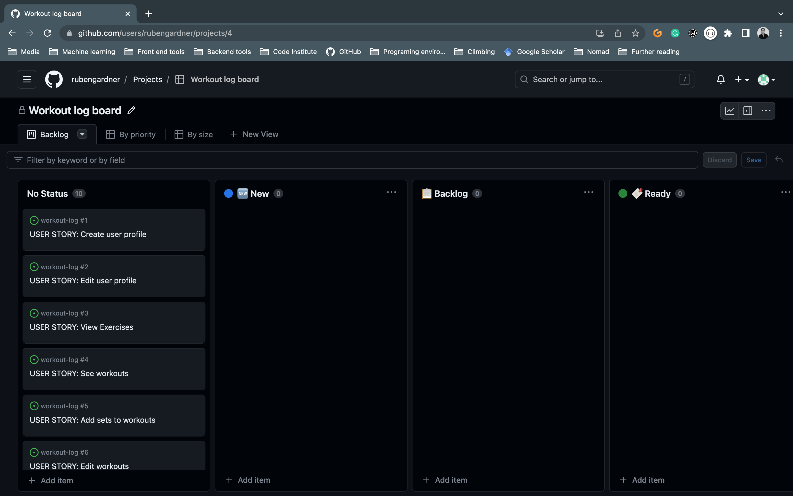

# **_Workout Log- Project Portfolio 5 - Advanced Front End (React)_**

Welcome to our innovative workout app! Designed to empower users in their fitness journey, our app provides a dynamic platform for creating custom exercises and tracking personal progress. With our user-friendly interface and comprehensive features, achieving your fitness goals has never been easier. Whether you're a beginner or a seasoned fitness enthusiast, our app offers a seamless experience for creating and managing your workout routines. From designing exercises tailored to your specific needs to monitoring your progress over time, our app is your ultimate fitness companion. Get ready to take charge of your workouts and witness remarkable transformations as you embark on your fitness adventure with our state-of-the-art workout app.

You can view the live site here - <a href="https://workout-log-front-end.herokuapp.com/" target="_blank" rel="noopener">Workout Log</a>

You can view the live API here - <a href="https://workout-log-api.herokuapp.com/" target="_blank" rel="noopener">Workout Log DRF API</a>

You can view the back-end README.md here - <a href="" target="_blank" rel="noopener">Workout Log Back-End README</a>

# Table of Contents

-   [1. UX](#user-experience)
    -   [1.1. Strategy](#strategy)
        -   [Project Goals](#project-goals) 
            -   [User Goals:](#user-goals) 
            -   [User stories](#user-stories)
            -   [Strategy Table](#strategy-table) 
-   [2. Wireframes](#wireframes)
-   [3. Surface](#surface) 
-   [4. Components](#components)
-   [4. Technologies Used](#technologies-used)
-   [5. Testing](#testing)
-   [6. Deployment](#deployment)
-   [7. Known Bugs](#known-bugs)
-   [8. Credits](#credits)

# User experience

## 1.1. Strategy

### Project Goals
1. The website should showcase a contemporary design that utilizes minimalistic colors, prioritizing the content and maintaining a clean aesthetic.
2. The website should be thoughtfully designed to provide optimal accessibility by adapting seamlessly to various screen sizes. This woulde ensure that users can easily access and navigate the website regardless of the device they are using.
3. User operations such as registration, login/logout, user profile creation, and CRUD should be simple
4. As a user, I want to easily create new data.
5. As a user, I want to be able to make changes to my existing data.
6. As a user, I want to be able to delete my existing data.
7. As a user, I want to be able to track my existing data.

### User stories:

User story| User goal| First iteration
------------ | -------------------------|---------
Display Exercises | 1, 2, 7 | Yes
Display Workouts | 1, 2, 7 | Yes
Account signup | 3, 4 | Yes
Responsive design | 2 | Yes
Create an Exercise | 1, 4 | Yes
Update an Exercise | 1, 5 | Yes
Delete an Exercise | 1, 6 | Yes
Create a Workout | 1, 4 | Yes
Update a Workout | 1, 5 | Yes
Delete a Workout | 1, 6 | Yes
Create a Set | 1, 4 | Yes
Update a Set | 1, 5 | Yes
Delete a Set | 1, 6 | Yes
Graphs tracking metrics | 1, 2, 7 | NO

Throughout the project, I effectively utilized the GitHub Projects board as my project management tool. This involved logging all user stories, allowing me to stay organized and on track. By moving relevant tasks to the "in progress" lane as I worked on them and subsequently shifting them to the "done" lane upon completion, I maintained a clear overview of my progress and ensured efficient task management. 

Backlog 1:

Backlog 2:

Backlog 3:

### Scope
The strategy table indicates that not all features can be immediately implemented in the initial release of the project. As a result, the project will be broken down into multiple phases. The initial phase will focus on incorporating the essential features necessary to create the minimum viable product.

Phase 1, MVP:
* CRUD functionality for Exercise, Workout and Sets
* Provide the option for users to create an account
* Design that adapts to different screen sizes

Phase 2:
 *

# Wireframes

Landing page:

Sign up / sign in:

List of workouts:

Workout specific:

# Surface

## Color palette

The website primarily utilizes the following colors:
* Gold: #F6CA80
* Dark grey: #36454F
* Light grey: #dfe0df
* Light Blue: #BECFDB
* The inherent colors from Bootstrap
* White
* Black

The website has been tested for accessibility using WebAIM's contrast checker to ensure that the text and background colors used on the website provide enough contrast for users to read the information displayed on the web.

Contrast check 1:

Contrast check 2:

### Typography

The main font used throughout the website is Poppins. In case Poppins is not imported correctly, the fallback font will be a sans-serif font. The choice of Poppins was made after researching fonts that are optimized for reading

# Components

In this Front-End application, I have demonstrated a clear understanding of the React architecture by implementing component reusability. The following five components were utilized in this project, showcasing the reusability aspect of React:

- Set.js: This component is responsible for rendering a set of exercises within a workout routine. It encapsulates the logic and rendering for a single set, making it reusable across multiple workout scenarios.

- Workout.js: The Workout component represents a complete workout session, composed of multiple sets. By creating a separate Workout component, we can easily reuse and manage workout-related functionality and UI across different parts of the application.

- Exercise.js: The Exercise component handles the rendering of individual exercises within a set or workout. It encapsulates the logic and rendering for a specific exercise, making it reusable across different sets or workout routines.

- Navbar.js: The Navbar component provides the navigation bar for the application. By extracting this into a separate component, we can reuse it across various pages or sections of the application, ensuring consistent navigation throughout.

- Footer.js: The Footer component represents the footer section of the application. By separating it into its own component, we can reuse it across different pages or sections, providing a consistent footer experience.

By organizing the application into these distinct reusable components, we promote code reusability, maintainability, and separation of concerns. Each component serves a specific purpose and can be easily integrated and reused within the application. This modular approach helps to enhance the overall architecture and scalability of the Front-End application.

# Technologies Used

## Languages

- [JavaScript](https://www.javascript.com/) - A dynamic programming language that's used for web development
- [HTML5](https://en.wikipedia.org/wiki/HTML5) - A markup language used for structuring and presenting content
- [CSS3](https://en.wikipedia.org/wiki/CSS) - A style sheet language used for describing the presentation of a document

## Libraries and Frameworks

- [React](https://reactjs.org/) - Advanced front-end JavaScript library for building user interfaces
- [Bootstrap](https://getbootstrap.com/) - Popular CSS Framework for developing responsive and mobile-first websites
- [Font Awesome](https://fontawesome.com/) - A font and icon toolkit based on CSS
- [Google Fonts](https://fonts.google.com/) - A library of 1482 open source font families and APIs for convenient use via CSS

## NPM Packages / Dependencies
- [PropTypes](https://www.npmjs.com/package/prop-types): PropTypes is a package used for defining the types of props passed to React components. It provides a way to specify the expected data types and shapes of props, helping to ensure the correctness and consistency of data flowing through the application.
- [react-notifications](https://www.npmjs.com/package/react-notifications)A package used for implementing notifications in React. It provides functionality to display success and error notifications for user actions.
- [axios](https://www.npmjs.com/package/axios) - An HTTP client library for making network requests from a React application. It simplifies the process of sending HTTP requests and handling responses.
- [jwt-decode](https://jwt.io/) - Library for decoding JWT tokens.
- [react-bootstrap](https://react-bootstrap.github.io/) - React components for using Bootstrap with React.
- [react-dom](https://reactjs.org/docs/react-dom.html) - React library for rendering components on the DOM
- [react-router-dom](https://www.npmjs.com/package/react-router-dom) - Library for routing in single-page applications.
- [react-scripts](https://www.npmjs.com/package/react-scripts) - Scripts for creating and building React projects with Create React App.

## Other Tools

- [WebAIM](https://webaim.org/resources/contrastchecker/) - Used to test the contrast and accessibility.
- [GitPod](https://gitpod.io/) - Used to create and edit the website.
- [GitHub](https://github.com/) - Used to host and deploy the website as well as manage the project.
- [Google Chrome DevTools](https://developer.chrome.com/docs/devtools/) - Used to test responsiveness and debug.
- [Responsive Design Checker](https://www.responsivedesignchecker.com/) - Used to test responsiveness.
- [Figma](https://www.figma.com/) - Used to create mock-up designs.
- [Heroku](https://dashboard.heroku.com) - Used to deploy the website
- [ESLint Validation](https://eslint.org/docs/latest/use/getting-started) - Used to validate JavaScript code

# Testing

## Manual Testing:

I have performed comprehensive responsive testing on all pages of the application across a diverse range of devices. The devices I have specifically tested include:
- iPhone SE
- iPhone XR
- iPhone 12 Pro
- Pixel 5
- Samsung Galaxy S8

### All Pages (Nav Bar):
TEST            | OUTCOME                          | PASS / FAIL  
--------------- | -------------------------------- | ---------------
Home page | When the "home" button in the navigation bar is clicked, the browser redirects the user to the home page and the "active" styling appears on the home button | PASS
Workouts page |When the "workouts" button in the navigation bar is clicked, the browser redirects the user to the workouts feed page and the "active" styling appears on the workouts button.  | PASS
Exercise page | When the "exercise" button in the navigation bar is clicked, the browser redirects the user to the exercise feed page and the "active" styling appears on the exercise button. | PASS
Log out | When the "Log out" button in the navigation bar is clicked, User is logged out | PASS
Log in |  When the "Log in" button in the navigation bar is clicked, the browser redirects the user to the Log in page and the "active" styling appears on the Log in button. | PASS
Sign in |  When the "Sign in" button in the navigation bar is clicked, the browser redirects the user to the Sign in page and the "active" styling appears on the Sign in button. | PASS
Foreground & background colour | Checked foreground information is not distracted by background color or images | PASS
Text | Checked that all fonts and colours used are consistent. | PASS

### Home
TEST            | OUTCOME                          | PASS / FAIL  
--------------- | -------------------------------- | ---------------
Responsiveness | All elements on the page have been checked to ensure consistent scalability across mobile, tablet, and desktop views..| PASS
Accessibility |The accessibility of the page has been checked using Lighthouse.| PASS
Links | All links are functional and take the user to the correct pages. | PASS

### Workouts page
TEST            | OUTCOME                          | PASS / FAIL  
--------------- | -------------------------------- | ---------------
Workout unit | When a workout unit is clicked, it's information is displayed. | PASS
Workout unit links | When a workout unit link is clicked, it redirects you to the correct page. | PASS
Responsiveness | All elements on the page have been checked to ensure consistent scalability across mobile, tablet, and desktop views..| PASS
Accessibility |The accessibility of the page has been checked using Lighthouse.| PASS
Links | All links are functional and take the user to the correct pages. | PASS

### Individual workout page
TEST            | OUTCOME                          | PASS / FAIL  
--------------- | -------------------------------- | ---------------
Sets | All sets that belong to the workout display | PASS
Add set | A modal is displayed and permits access to the form to create a set | PASS
Add set modal | Closes when the form is submited correctly or outside the form is clicked | PASS
Workout unit links | When a workout unit link is clicked, it redirects you to the correct page. | PASS
Responsiveness | All elements on the page have been checked to ensure consistent scalability across mobile, tablet, and desktop views..| PASS
Accessibility |The accessibility of the page has been checked using Lighthouse.| PASS
Links | All links are functional and take the user to the correct pages. | PASS

## Exercises page
TEST            | OUTCOME                          | PASS / FAIL  
--------------- | -------------------------------- | ---------------
Exercise unit | When a exercise unit is clicked, it's information is displayed. | PASS
Responsiveness | All elements on the page have been checked to ensure consistent scalability across mobile, tablet, and desktop views..| PASS
Accessibility |The accessibility of the page has been checked using Lighthouse.| PASS
Links | All links are functional and take the user to the correct pages. | PASS

## Add Exercise page
TEST            | OUTCOME                          | PASS / FAIL  
--------------- | -------------------------------- | ---------------
Exercise |When the form is submited correctly, the user is redirected to exercise feed. | PASS
Responsiveness | All elements on the page have been checked to ensure consistent scalability across mobile, tablet, and desktop views..| PASS
Accessibility |The accessibility of the page has been checked using Lighthouse.| PASS
Links | All links are functional and take the user to the correct pages. | PASS

## Edit forms
TEST            | OUTCOME                          | PASS / FAIL  
--------------- | -------------------------------- | ---------------
Forms | Forms are populated with the correct data | PASS

# Deployemnt
To create a new Heroku app, you can follow these steps:

- Sign into Heroku: Go to the Heroku website and sign in to your account.

- Select New: Once you're logged in, navigate to your dashboard or the Heroku dashboard homepage.

- Select Create New App: Look for the "New" button or link, usually located in the top right corner of the dashboard. Click on it to create a new app.

- Enter a relevant app name: In the app creation form, provide a name for your app. Choose a name that is descriptive and relevant to the project you're working on.

- Select the appropriate region: Heroku provides several regions where you can deploy your app. Choose the region that is closest to your target audience or where you prefer your app to be hosted.

- Click the Create App button: Once you have filled in the necessary information, click the "Create App" button to create your new Heroku app.

- Commit and push all files to GitHub: Ensure that all the files related to your project are committed and pushed to your GitHub repository. This step ensures that the latest code changes are available for deployment.

- Deploy to Heroku: In your Heroku app dashboard, navigate to the "Deploy" tab.

- Manual deploy: Scroll down to the "Manual deploy" section, where you'll find options to deploy your app from different branches. Select the branch you want to deploy.

- Click the "Deploy Branch" button: Once you have chosen the branch, click on the "Deploy Branch" button. Heroku will start the deployment process and build your app using the provided code from the selected branch.

# Known bugs

There are two known bugs in the set creation feature that need to be addressed:

Incorrect exercise selection in the dropdown: Currently, the dropdown allows the selection of all exercises, regardless of whether they belong to the user or not. The intended behavior is to only permit the selection of exercises that belong to the user. This bug needs to be fixed so that only the user's exercises are available for selection in the dropdown.

Mandatory entry for unit 2: Presently, when creating a set, the value for unit 2 is required to be filled, even if the exercise does not have a second unit. This is an issue because some exercises may not have a second unit. The bug needs to be addressed by allowing the unit 2 field to be optional when it is not applicable to the exercise.

To resolve the first bug, the following steps can be taken:

Retrieve the list of exercises belonging to the user.
Update the dropdown menu to populate only with the exercises from the user's list.
Ensure that the selection mechanism filters out any exercises that are not owned by the user.
To address the second bug, the following approach can be adopted:

Modify the set creation form to include a checkbox or toggle indicating whether the exercise has a second unit.
When the checkbox is selected or toggled to indicate the presence of a second unit, the unit 2 field should be made mandatory.
When the checkbox is deselected or toggled to indicate the absence of a second unit, the unit 2 field should become optional, allowing the user to leave it blank.
By implementing these fixes, users will only be able to select their own exercises from the dropdown, and they will have the flexibility to enter a value for unit 2 only when it is applicable to the exercise being added to the set. These updates will enhance the user experience and improve the accuracy of the set creation process.

# Credits

## Content

This project was inspired by the [Code Institute](https://codeinstitute.net/) walk-through **Moments** project and has been heavily modified

The files which have been created and used for the League Hub project that have been copied from the **Moments** walkthrough project were the following

- CurrentUserContext.js
- useRedirect.js
- axiosDefault.js
