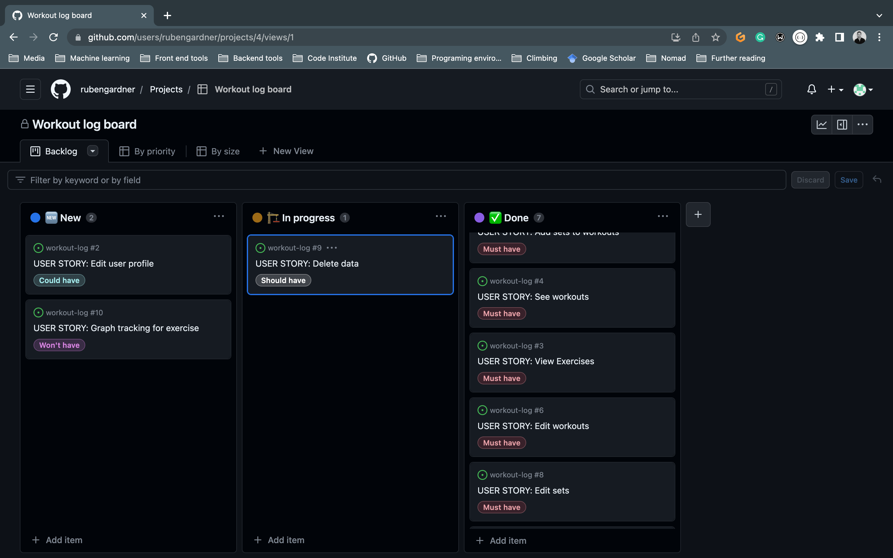

# **_Workout Log- Project Portfolio 5 - Advanced Front End (React)_**

Welcome to our innovative workout app! Designed to empower users in their fitness journey, our app provides a dynamic platform for creating custom exercises and tracking personal progress. With our user-friendly interface and comprehensive features, achieving your fitness goals has never been easier. Whether you're a beginner or a seasoned fitness enthusiast, our app offers a seamless experience for creating and managing your workout routines. From designing exercises tailored to your specific needs to monitoring your progress over time, our app is your ultimate fitness companion. Get ready to take charge of your workouts and witness remarkable transformations as you embark on your fitness adventure with our state-of-the-art workout app.

You can view the live site here - <a href="" target="_blank" rel="noopener">Workout Log/a>

You can view the live API here - <a href="" target="_blank" rel="noopener">Workout Log DRF API</a>

You can view the back-end README.md here - <a href="" target="_blank" rel="noopener">Workout Log Back-End README</a>

# Table of Contents

-   [1. UX](#user-experience)
    -   [1.1. Strategy](#strategy)
        -   [Project Goals](#project-goals) 
            -   [User Goals:](#user-goals) 
            -   [User stories](#user-stories)
            -   [Strategy Table](#strategy-table) 
-   [2. Wireframes](#wireframes)
-   [3. Surface](#surface) 
-   [4. Technologies Used](#technologies-used)
-   [5. Testing](#testing)
-   [6. Deployment](#deployment)
-   [7. Known Bugs](#known-bugs)
-   [8. Credits](#credits)

# User experience

## 1.1. Strategy

### Project Goals
* The website showcases a contemporary design that utilizes minimalistic colors, prioritizing the content and maintaining a clean aesthetic.
* The website is thoughtfully designed to provide optimal accessibility by adapting seamlessly to various screen sizes. This ensures that users can easily access and navigate the website regardless of the device they are using.
* TThe primary goal of this project is to streamline and simplify key user operations, including registration, login/logout, user profile creation, and CRUD (Create, Read, Update, Delete) functionality for workouts and exercise tracking. By focusing on enhancing user experience and efficiency, we aim to make these processes seamless and user-friendly.

### User Goals:
First Time Visitor Goals:
* As a new visitor, I want to easily understand the app layout.
* As a new visitor, I want to easily create new exercises and workouts.

Returning Visitor Goals
* As a repeat user, I want to be able to make changes to my existing exercises, workouts and sets.
* As a repeat user, I want to be able to track my existing exercises, workouts and sets.

### User stories:
Throughout the project, I effectively utilized the GitHub Projects board as my project management tool. This involved logging all user stories, allowing me to stay organized and on track. By moving relevant tasks to the "in progress" lane as I worked on them and subsequently shifting them to the "done" lane upon completion, I maintained a clear overview of my progress and ensured efficient task management. 

Backlog 1:

Backlog 2:

Backlog 3:

### Strategy Table
Task| Importance| Viability/Feasibility
------------ | -------------------------|---------
Display Exercises | 5 | 5
Display Workouts | 5 | 5
Account signup | 5 | 4
User resevation display | 5 | 5
Responsive design | 5 | 5
Contact page | 5 | 5
Create an Exercise | 5 | 4
Update an Exercise | 5 | 4
Delete an Exercise | 5 | 4
Create a Workout | 5 | 4
Update a Workout | 5 | 4
Delete a Workout | 5 | 4
Create a Set | 5 | 4
Update a Set | 5 | 4
Delete a Set | 5 | 4
Graphs tracking metrics | 4 | 1

### Scope
The strategy table indicates that not all features can be immediately implemented in the initial release of the project. As a result, the project will be broken down into multiple phases. The initial phase will focus on incorporating the essential features necessary to create the minimum viable product.

Phase 1:
* CRUD functionality for Exercise, Workout and Sets
* Provide the option for users to create an account
* Design that adapts to different screen sizes

# Wireframes

Landing page:

Sign up / sign in:

List of workouts:

Workout specific:

# Surface

## Color palette

The website primarily utilizes the following colors:
* Gold: #F6CA80
* Dark grey: #36454F
* Light grey: #dfe0df
* Light Blue: #BECFDB
* The inherent colors from Bootstrap
* White
* Black

The website has been tested for accessibility using WebAIM's contrast checker to ensure that the text and background colors used on the website provide enough contrast for users to read the information displayed on the web.

Contrast check 1:

Contrast check 2:

### Typography

The main font used throughout the website is Poppins. In case Poppins is not imported correctly, the fallback font will be a sans-serif font. The choice of Poppins was made after researching fonts that are optimized for reading

# testing

## All Pages (Nav Bar):
TEST            | OUTCOME                          | PASS / FAIL  
--------------- | -------------------------------- | ---------------
Home page | When the "home" button in the navigation bar is clicked, the browser redirects the user to the home page and the "active" styling appears on the home button | PASS
Workouts page |When the "workouts" button in the navigation bar is clicked, the browser redirects the user to the workouts feed page and the "active" styling appears on the workouts button.  | PASS
Exercise page | When the "exercise" button in the navigation bar is clicked, the browser redirects the user to the exercise feed page and the "active" styling appears on the exercise button. | PASS
Log out | When the "Log out" button in the navigation bar is clicked, User is logged out | PASS
Log in |  When the "Log in" button in the navigation bar is clicked, the browser redirects the user to the Log in page and the "active" styling appears on the Log in button. | PASS
Sign in |  When the "Sign in" button in the navigation bar is clicked, the browser redirects the user to the Sign in page and the "active" styling appears on the Sign in button. | PASS
Foreground & background colour | Checked foreground information is not distracted by background color or images | PASS
Text | Checked that all fonts and colours used are consistent. | PASS

## Home
TEST            | OUTCOME                          | PASS / FAIL  
--------------- | -------------------------------- | ---------------
Responsiveness | All elements on the page have been checked to ensure consistent scalability across mobile, tablet, and desktop views..| PASS
Accessibility |The accessibility of the page has been checked using Lighthouse.| PASS
Links | All links are functional and take the user to the correct pages. | PASS

## Workouts page
TEST            | OUTCOME                          | PASS / FAIL  
--------------- | -------------------------------- | ---------------
Workout unit | When a workout unit is clicked, it's information is displayed. | PASS
Workout unit links | When a workout unit link is clicked, it redirects you to the correct page. | PASS
Responsiveness | All elements on the page have been checked to ensure consistent scalability across mobile, tablet, and desktop views..| PASS
Accessibility |The accessibility of the page has been checked using Lighthouse.| PASS
Links | All links are functional and take the user to the correct pages. | PASS

## Individual workout page
TEST            | OUTCOME                          | PASS / FAIL  
--------------- | -------------------------------- | ---------------
Sets | All sets that belong to the workout display | PASS
Add set | A modal is displayed and permits access to the form to create a set | PASS
Add set modal | Closes when the form is submited correctly or outside the form is clicked | PASS
Workout unit links | When a workout unit link is clicked, it redirects you to the correct page. | PASS
Responsiveness | All elements on the page have been checked to ensure consistent scalability across mobile, tablet, and desktop views..| PASS
Accessibility |The accessibility of the page has been checked using Lighthouse.| PASS
Links | All links are functional and take the user to the correct pages. | PASS

## Exercises page
TEST            | OUTCOME                          | PASS / FAIL  
--------------- | -------------------------------- | ---------------
Exercise unit | When a exercise unit is clicked, it's information is displayed. | PASS
Responsiveness | All elements on the page have been checked to ensure consistent scalability across mobile, tablet, and desktop views..| PASS
Accessibility |The accessibility of the page has been checked using Lighthouse.| PASS
Links | All links are functional and take the user to the correct pages. | PASS

## Add Exercise page
TEST            | OUTCOME                          | PASS / FAIL  
--------------- | -------------------------------- | ---------------
Exercise |When the form is submited correctly, the user is redirected to exercise feed. | PASS
Responsiveness | All elements on the page have been checked to ensure consistent scalability across mobile, tablet, and desktop views..| PASS
Accessibility |The accessibility of the page has been checked using Lighthouse.| PASS
Links | All links are functional and take the user to the correct pages. | PASS

## Edit forms
TEST            | OUTCOME                          | PASS / FAIL  
--------------- | -------------------------------- | ---------------
Forms | Forms are populated with the correct data | PASS

# Technologies Used

## Languages

- [JavaScript](https://www.javascript.com/) - A dynamic programming language that's used for web development
- [HTML5](https://en.wikipedia.org/wiki/HTML5) - A markup language used for structuring and presenting content
- [CSS3](https://en.wikipedia.org/wiki/CSS) - A style sheet language used for describing the presentation of a document

## Libraries and Frameworks

- [React](https://reactjs.org/) - Advanced front-end JavaScript library for building user interfaces
- [Bootstrap](https://getbootstrap.com/) - Popular CSS Framework for developing responsive and mobile-first websites
- [Font Awesome](https://fontawesome.com/) - A font and icon toolkit based on CSS
- [Google Fonts](https://fonts.google.com/) - A library of 1482 open source font families and APIs for convenient use via CSS

## NPM Packages / Dependencies

- [axios](https://www.npmjs.com/package/axios) - HTTP client for making network requests.
- [jwt-decode](https://jwt.io/) - Library for decoding JWT tokens.
- [react-bootstrap](https://react-bootstrap.github.io/) - React components for using Bootstrap with React.
- [react-dom](https://reactjs.org/docs/react-dom.html) - React library for rendering components on the DOM
- [react-router-dom](https://www.npmjs.com/package/react-router-dom) - Library for routing in single-page applications.
- [react-scripts](https://www.npmjs.com/package/react-scripts) - Scripts for creating and building React projects with Create React App.

## Other Tools

- [a11y](https://color.a11y.com/Contrast/) - Used to test the contrast and accessibility.
- [GitPod](https://code.visualstudio.com/) - Used to create and edit the website.
- [GitHub](https://github.com/) - Used to host and deploy the website as well as manage the project.
- [GitBash](<https://en.wikipedia.org/wiki/Bash_(Unix_shell)>) - Terminal used to push changes to the GitHub repository.
- [Google Chrome DevTools](https://developer.chrome.com/docs/devtools/) - Used to test responsiveness and debug.
- [Responsive Design Checker](https://www.responsivedesignchecker.com/) - Used to test responsiveness.
- [Figma](https://www.figma.com/) - Used to create mock-up designs.
- [Heroku](https://dashboard.heroku.com) - Used to deploy the website
- [JSHint Validation](https://jshint.com/) - Used to validate JavaScript code

# Deployemnt
Create new Heroku app
    - Sign into Heroku
    - Select New
    - Select create new app
    - Enter a relevant app name
    - Select appropriate region
    - Select the create app button
    - Commit and push all files to GitHub
    - In the deploy tab, go to the manual deploy sections and click deploy branch.

# Credits

## Content

This project was inspired by the [Code Institute](https://codeinstitute.net/) walk-through **Moments** project and has been heavily modified

The files which have been created and used for the League Hub project that have been copied from the **Moments** walkthrough project were the following

- CurrentUserContext.js
- useRedirect.js
- axiosDefault.js

Additional files that I have drawn inspiration from and modified to meet the League Hubs needs were the following

- SignIn.js
- SignUp.js
- Comment.js
- CommentCreate.js
- CommentEdit.js
- Asset.js
- utils.js